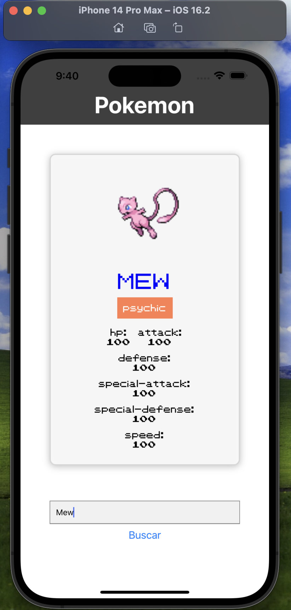
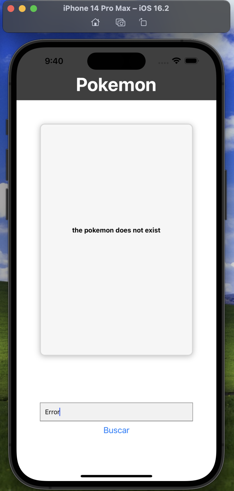

# Pokemon-Finder

Simple app to practice the use of pokeapi and learn React native

## Objetives

<ul>
    <li>See an image of the pokemon, its statistics and its type</li>
    <li>Make a finder</li>
    <li>error management</li>
</ul>

### images
+ Main
    - 
+ Error
    - 